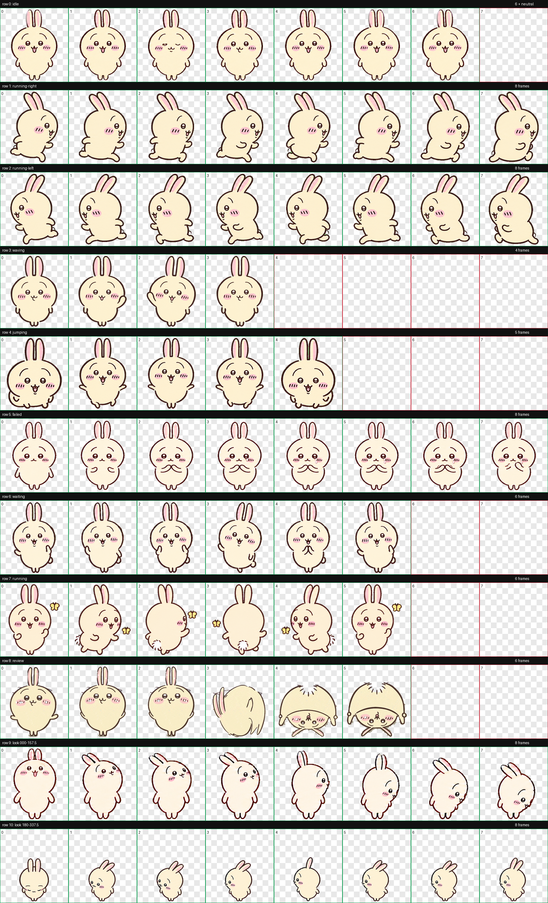
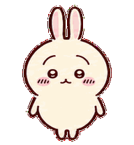
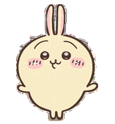
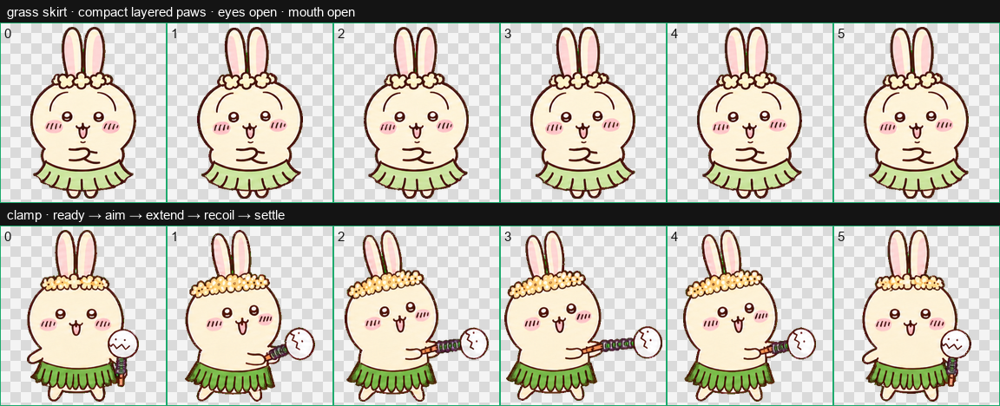

# Codex 乌萨奇桌宠

一只为 Codex Desktop 制作的乌萨奇风格动态桌宠。经过多轮动作与比例调整，保留圆润脸型、暖黄色配色、粉色腮红和小巧四肢，并加入追蝴蝶等个性动作。



## 特点

- Codex Desktop v2 桌宠格式
- 8 × 11 精灵图，共 88 个标准格位
- 包含待机、左右移动、挥手、跳跃、失败、等待、工作和检查动作
- 支持 16 个环视方向
- 工作状态会出现追逐黄色蝴蝶的动作
- 检查状态会转身弯腰，再从两腿之间倒着探头
- 失败状态采用身体互换篇中的“乌萨奇身体里的吉伊卡哇”，会胆怯地缩手、含泪并轻轻吸鼻子
- 侧面和背面采用更圆润的轮廓，不使用细长的豆形身体
- 保持睁眼、暖黄色身体、深棕色线条和粉色腮红

## 失败动作

`failed` 状态参考身体互换篇第 207—208 话：外形仍是乌萨奇，但表情和动作换成吉伊卡哇的胆怯反应。8 帧始终睁眼、保持直耳，从不安站立逐渐变为双手收在胸前、眼眶含泪，最后轻轻吸鼻子。



## 检查动作

`review` 状态采用第 80 话拍照场景中的搞怪动作：先正面停顿，随后快速转身弯腰，最后倒着从两腿之间探头。



## 特别动作设计

草裙抱胸动作与连贯夹子动作的设计稿：



## 安装

1. 下载本仓库中的 `pet.json` 和 `spritesheet.webp`。
2. 在 macOS 终端执行：

```bash
mkdir -p ~/.codex/pets/usagi
cp pet.json ~/.codex/pets/usagi/pet.json
cp spritesheet.webp ~/.codex/pets/usagi/spritesheet.webp
```

3. 重新打开 Codex，或重新选择一次“乌萨奇”桌宠以刷新贴图缓存。

## 文件说明

```text
codex-usagi-pet/
├── README.md
├── pet.json
├── spritesheet.webp
└── assets/
    ├── contact-sheet.png
    ├── failed-action.gif
    ├── review-action.gif
    └── special-actions.png
```

- `pet.json`：桌宠名称、说明与 v2 格式声明。
- `spritesheet.webp`：可直接安装的透明动态精灵图，尺寸为 1536 × 2288。
- `assets/contact-sheet.png`：全部动作与环视方向总览。
- `assets/failed-action.gif`：失败状态的 8 帧身体互换动作预览。
- `assets/review-action.gif`：检查状态的 6 帧动作预览。
- `assets/special-actions.png`：草裙与夹子动作设计展示。

## 说明

这是由 Biodog06 与 Codex 共同调整的非官方同人桌宠，仅供个人学习与非商业使用。乌萨奇及相关角色版权归原作者 Nagano 与相关权利方所有，本仓库与官方无关。
